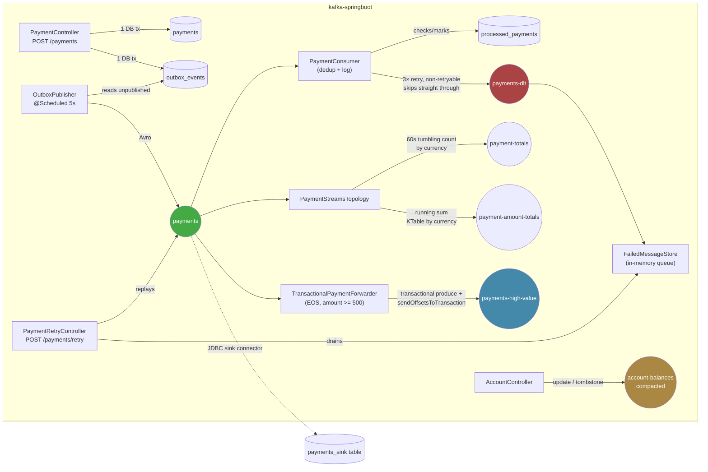

# Architecture

This is the detailed map of the repo: what's running, what topics exist, and which file implements which Kafka concept. Read this before picking up work in a new session — [README.md](../README.md) is the quick overview.

## Data flow

## Modules

### `kafka-producer/`, `kafka-consumer/`
Bare-bones standalone Kotlin apps (no Spring). Plain `KafkaProducer`/`KafkaConsumer`, string serde, no schema registry. These predate `kafka-springboot` and were the "hello world" step — not part of the running system in `docker-compose.yml`.

### `kafka-springboot/` — the main app
Spring Boot 4.1.0 + Kotlin 2.3.21, Java 21 toolchain. Spring Data JPA + PostgreSQL, Spring Kafka + Kafka Streams, Avro via Confluent's `kafka-avro-serializer`/`kafka-streams-avro-serde` against the Schema Registry.

Key files:
- [`kafka/KafkaConfig.kt`](../kafka-springboot/src/main/kotlin/com/example/kafka_springboot/kafka/KafkaConfig.kt) — all topic definitions, producer/consumer factories, the DLT error handler.
- [`PaymentController.kt`](../kafka-springboot/src/main/kotlin/com/example/kafka_springboot/PaymentController.kt) / [`OutboxPublisher.kt`](../kafka-springboot/src/main/kotlin/com/example/kafka_springboot/OutboxPublisher.kt) — outbox pattern.
- [`PaymentConsumer.kt`](../kafka-springboot/src/main/kotlin/com/example/kafka_springboot/PaymentConsumer.kt) / [`ProcessedPaymentStore.kt`](../kafka-springboot/src/main/kotlin/com/example/kafka_springboot/ProcessedPaymentStore.kt) — idempotent consumer + DLT handling.
- [`kafka/PaymentStreamsTopology.kt`](../kafka-springboot/src/main/kotlin/com/example/kafka_springboot/kafka/PaymentStreamsTopology.kt) — Kafka Streams windowing/aggregation.
- [`kafka/TransactionalPaymentForwarder.kt`](../kafka-springboot/src/main/kotlin/com/example/kafka_springboot/kafka/TransactionalPaymentForwarder.kt) — exactly-once transactional producer/consumer.
- [`kafka/RoundRobinPartitioner.kt`](../kafka-springboot/src/main/kotlin/com/example/kafka_springboot/kafka/RoundRobinPartitioner.kt) — custom partitioner, wired into the main producer factory.
- [`AccountController.kt`](../kafka-springboot/src/main/kotlin/com/example/kafka_springboot/AccountController.kt) — compacted-topic + tombstone demo.

### `kafka-connect/`
Custom `cp-kafka-connect` image with the Confluent JDBC connector plugin plus a manually-added Postgres driver (JDBC connectors don't ship DB drivers). [`connectors/jdbc-sink.json`](../kafka-connect/connectors/jdbc-sink.json) is a **sink** connector: upserts the `payments` Avro topic into a `payments_sink` table, keyed by `paymentId`. There is no source/CDC connector — see the gap noted in the README.

## Topics

| Topic | Partitions | Config | Written by | Read by |
|---|---|---|---|---|
| `payments` | 3 | Avro (`PaymentRequest.avsc`) | `OutboxPublisher`, `PaymentRetryController` | `PaymentConsumer`, `PaymentStreamsTopology`, `TransactionalPaymentForwarder`, JDBC sink connector |
| `payments-dlt` | 3 | Avro | Spring's `DeadLetterPublishingRecoverer` (after 3 retries) | `PaymentConsumer.handleDlt` → `FailedMessageStore` |
| `payment-totals` | 3 | String | `PaymentStreamsTopology` (tumbling 60s count) | `PaymentConsumer.handleTotals` |
| `payment-amount-totals` | 3 | String | `PaymentStreamsTopology` (running KTable sum) | `PaymentConsumer.handleAmountTotals` |
| `payments-high-value` | 3 | Avro | `TransactionalPaymentForwarder` (amount ≥ 500, EOS) | — |
| `account-balances` | 1 | **Compacted**, tombstones kept 1s, aggressive dirty-ratio (0.01) | `AccountController` | — |

## Pattern catalog

Where each Kafka concept actually lives in this repo.

| Concept | Where | Notes |
|---|---|---|
| Producer/consumer basics | `kafka-producer/`, `kafka-consumer/` | Plain client, no framework. |
| Consumer groups + rebalancing | `payments-consumer-group` etc. in `KafkaConfig.kt` | Multiple groups per topic (`payment-totals-group`, `payments-dlt-consumer-group`, ...). |
| Custom partitioner | `RoundRobinPartitioner.kt` | Wired via `ProducerConfig.PARTITIONER_CLASS_CONFIG`. |
| Dead Letter Topic + retry | `KafkaConfig.errorHandler` + `PaymentRetryController` | 3 retries / 1s backoff via `DefaultErrorHandler` + `FixedBackOff`; manual redrive endpoint, not automatic. |
| Avro + Schema Registry | `PaymentRequest.avsc`, `KafkaAvroSerializer`/`Deserializer` throughout | `SPECIFIC_AVRO_READER_CONFIG = false` → `GenericRecord`, not generated POJOs. |
| Idempotent consumer | `ProcessedPaymentStore.kt` | Business-level dedup (Postgres unique check in its own `REQUIRES_NEW` tx) — distinct from producer idempotence (`enable.idempotence=true`, also on). |
| Kafka Streams — KStream/KTable/windowing | `PaymentStreamsTopology.kt` | Tumbling window count (KStream) + unbounded aggregate (KTable), both by currency. |
| Kafka Connect — sink | `kafka-connect/` | JDBC sink only; no source/CDC connector exists yet. |
| Exactly-once semantics | `TransactionalPaymentForwarder.kt` | `initTransactions`/`beginTransaction`/`sendOffsetsToTransaction`/`commitTransaction`, `read_committed` isolation on the consuming side. |
| Log compaction | `account-balances` topic config in `KafkaConfig.kt` | Tombstone via `AccountController.deleteAccount` (raw producer — `KafkaTemplate` can't send null values in Kotlin). |
| Replication + ISR | `docker-compose.yml` | Single broker, `replication.factor=1` everywhere — real replication behavior isn't actually exercised locally; understood conceptually only. |
| ksqlDB | `docker-compose.yml` (`ksqldb-server`, `ksqldb-cli`) | Services are running; no `.sql` scripts or STREAM/TABLE definitions committed yet. |

## Known gaps (see also README)

- No Testcontainers/integration tests — only the default `contextLoads()` placeholder.
- No Debezium or other CDC source connector, despite an earlier (now-corrected) roadmap note claiming otherwise.
- `FailedMessageStore` is in-memory only — a restart silently drops anything staged for retry.
- ksqlDB and Kafka Streams both compute currency aggregates, redundantly — never reconciled/compared against each other.
